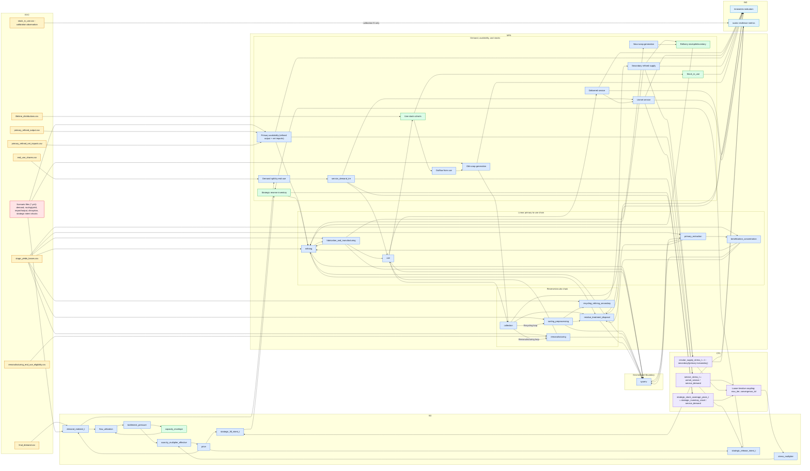

# Coupled SD-dMFA Flowchart

This is the canonical system flowchart for the current model implementation.

- Data input files are shown in amber.
- Scenario files are shown in rose.
- Model processes are shown in blue.
- Model stocks are shown in green.
- Coupling/control nodes are shown in violet.

## Update rule

Update this diagram whenever any of the following changes:

- `configs/coupling.yml`
- `src/crm_model/coupling/runner.py`
- `src/crm_model/sd/builder.py`
- `src/crm_model/mfa/builder.py`
- `registry/variable_registry.yml`
- `configs/stages.yml`

Minimum update checklist:

1. Exogenous node list still matches configured inputs/boundary.
2. SD->dMFA and dMFA->SD coupling arrows still match code.
3. Indicator/output nodes still match `configs/indicators.yml`.
